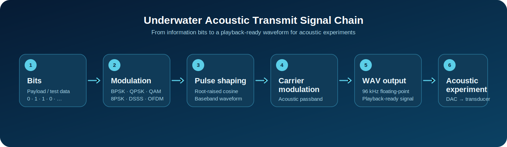
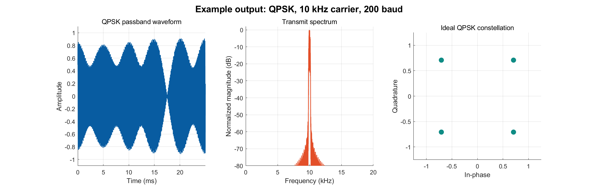

# Underwater Acoustic Signal Modulation

[](https://github.com/ZoperIOT/underwater-acoustic-modulation/releases)
[](LICENSE)
[](https://github.com/ZoperIOT/underwater-acoustic-modulation/commits/main)

A MATLAB **transmit-side** modulation toolkit for underwater acoustic communication experiments. It turns information bits into playback-ready acoustic passband waveforms and WAV files—ideal for quickly building a transmitter stimulus for tank, near-shore, or transducer-bench experiments.

[中文文档 / Chinese documentation](README.md) · [View releases](https://github.com/ZoperIOT/underwater-acoustic-modulation/releases) · [Quick start](#quick-start)



## What this toolkit gives you

- Generate normalized real passband waveforms using BPSK, QPSK, 8PSK, QAM, DSSS, or OFDM.
- Tune sample rate, carrier frequency, symbol rate, and root-raised-cosine pulse shaping.
- Write standard `.wav` files for DAC, power-amplifier, and transducer experiments.
- Switch schemes through the unified `generate_signal` entry point.

> **Scope:** this repository implements transmit waveform generation only. Demodulation, synchronization, channel estimation, and BER analysis are intentionally out of scope.

## Supported modulations

| Function | Modulation | Default carrier / rate |
| --- | --- | --- |
| `BPSK` | BPSK | 10 kHz / 200 Baud |
| `QPSK` | QPSK | 10 kHz / 200 Baud |
| `pad_8PSK` | 8PSK | 10 kHz / 200 Baud |
| `QAMtrain` | Square QAM (16QAM by default) | 10 kHz / 200 Baud |
| `DSSS` | DSSS-BPSK with an m-sequence | 11 kHz / 37.8 bit/s |
| `OFDM` | Pilot-aided QPSK-OFDM | 10 kHz / 7.5 Hz subcarrier spacing |

## Quick start

```matlab
addpath('src');

% Generate a 128-bit QPSK acoustic transmit waveform.
bits = randi([0 1], 1, 128);
[waveform, info] = QPSK(bits);

% Save a 96 kHz WAV file explicitly.
audiowrite('qpsk_10k.wav', waveform, info.sampleRate);

% Switch modulation schemes through the unified entry point.
[ofdmWaveform, ofdmInfo] = generate_signal('ofdm', [], ...
    struct('carrierFrequency', 12000, 'numberOfOFDMSymbols', 10));
```

## What does the output look like?

The figure below is generated from the included QPSK example. It shows the actual passband waveform sent to the playback chain, its normalized spectrum, and the ideal symbol constellation before pulse shaping.



Regenerate the diagnostics in MATLAB:

```matlab
run('examples/generate_visualizations.m')
```

Run `examples/generate_examples.m` to create one WAV file for every supported modulation. Audio files are written to `examples/output/` but are not committed to Git.

## Options

Pass a scalar MATLAB struct as the final argument. Omitted fields use the defaults.

```matlab
% BPSK at 12 kHz and 400 Baud with a 0.5 roll-off factor.
opt = struct('sampleRate', 96000, 'carrierFrequency', 12000, ...
             'symbolRate', 400, 'rolloff', 0.5);
[w, meta] = BPSK(randi([0 1], 1, 256), opt);

% 64QAM.
[w, meta] = QAMtrain(randi([0 1], 1, 600), struct('order', 64));

% DSSS with 127 chips per information bit.
[w, meta] = DSSS(randi([0 1], 1, 32), ...
    struct('spreadingFactor', 127, 'carrierFrequency', 11000));
```

For single-carrier schemes, `sampleRate / symbolRate` must be an integer. For DSSS, `sampleRate / (symbolRate * spreadingFactor)` must be an integer. The bit length for QPSK, 8PSK, and QAM must be divisible by the number of bits per symbol. OFDM automatically pads the final frame with zero bits and records the count in `info.paddingBits`.

## Acoustic experiment notes

The default configuration—96 kHz sampling and a 10 kHz carrier—is a practical starting point. Before deployment, tune the carrier, symbol rate, and output scaling to match your transducer bandwidth, acoustic channel, power amplifier, and DAC full-scale range. The generated waveform is a bipolar floating-point signal in `[-1, 1]`; convert it to `uint16` or another device-specific format immediately before output if required.

## Project layout

```text
src/                               Modulators and internal utilities
data/s_Gold_data.mat               Gold-code reference data from the original project
examples/generate_examples.m       Generate WAV files for all schemes
examples/generate_visualizations.m Generate the README diagnostic preview
examples/output/                   Reproducible PNG preview and local WAV output
docs/images/                       README project-overview visual
```

## Dependencies and license

The implementation uses MATLAB base numerical functions only. The root-raised-cosine filter is implemented inside this repository, so Communications Toolbox is not required. Released under the [MIT License](LICENSE).
